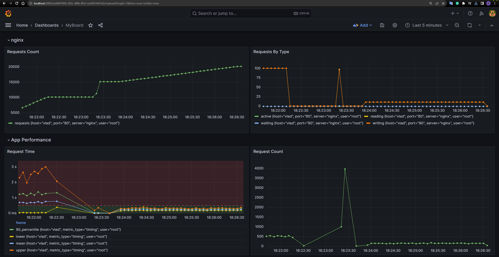
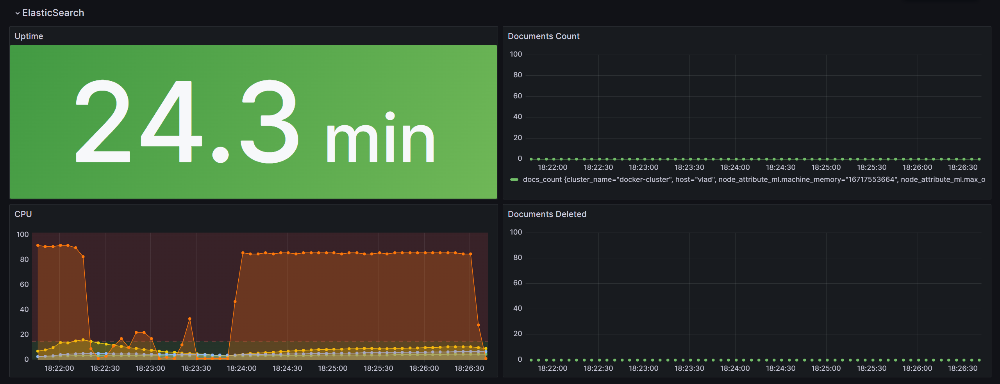
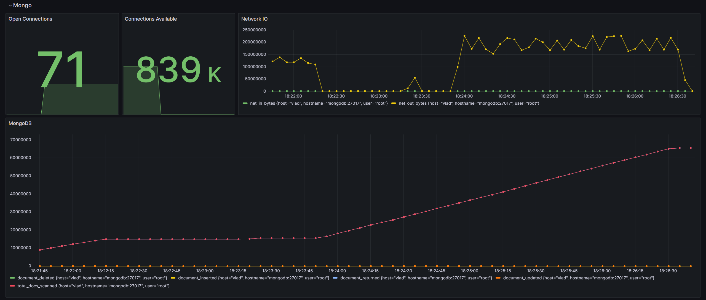
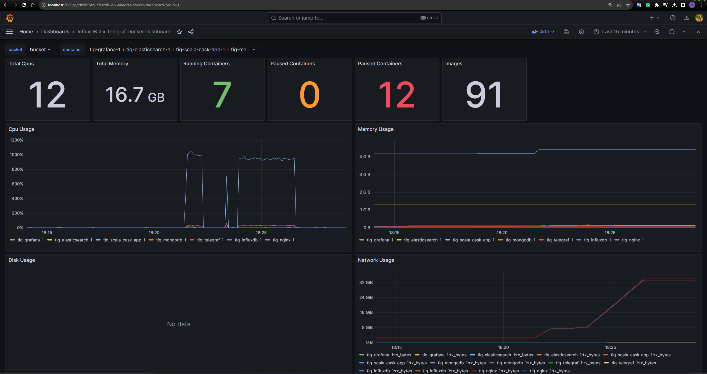

# Example Docker Compose project for Telegraf, InfluxDB, Grafana, MongoDB, and Elasticsearch

## Overview
This project is a comprehensive environment that includes a Scala application, MongoDB, Nginx, Elasticsearch, and Telegraf. The system is designed to compile a Scala application into a Docker container and orchestrate the services using Docker Compose.

## Prerequisites
- Docker
- Docker Compose
- Bash Shell (for running scripts)

## Setup and Running Services

To get started, follow the steps below to set up your environment:

### Step 1: Compile Scala Application into Docker

Navigate to the `scala-app` directory and use the `mill` build tool to build your Scala application Docker image, then start up all services using Docker Compose.

```bash
./scala-app/mill app.docker.build
docker compose up -d
```

This command will:
- Build the Docker image for the Scala application.
- Spin up the MongoDB, Nginx, Scala application, Elasticsearch, and Telegraf services in detached mode.

### Step 2: Perform Load Testing

To make 5000 requests to your Nginx server with a concurrency level of 100, where each request queries 1000 entries from MongoDB, run the following script:

```bash
./run_test.sh -n 5000 -c 100 -s tig-nginx-1 -e 1000 -u http://nginx/reviews
```

This script will execute the load test using the parameters specified. Ensure that `run_test.sh` is executable before running the command.

## Accessing Services

After starting the services, they can be accessed at the following locations:

- InfluxDB: http://localhost:8086
- Grafana: http://localhost:3000
- Nginx: http://localhost (port 80)

These endpoints allow you to interact with the respective services directly from your web browser.

## Customizing Tests

You can customize the load test by changing the parameters of the `run_test.sh` script:

- `-n`: Number of requests to perform.
- `-c`: Number of multiple requests to make at a time.
- `-s`: Service name for the network container.
- `-e`: Number of entries queried from the server.
- `-u`: The base URL to which the requests are made.


## Screenshots Of Grafana Dashboard

### My Board

My cherry-picked metrics from Scala application, MongoDB, Nginx and Elasticsearch.





### Docker Board

Imported template from grafana website with docker metrics.


